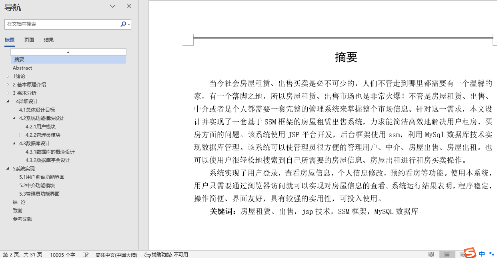
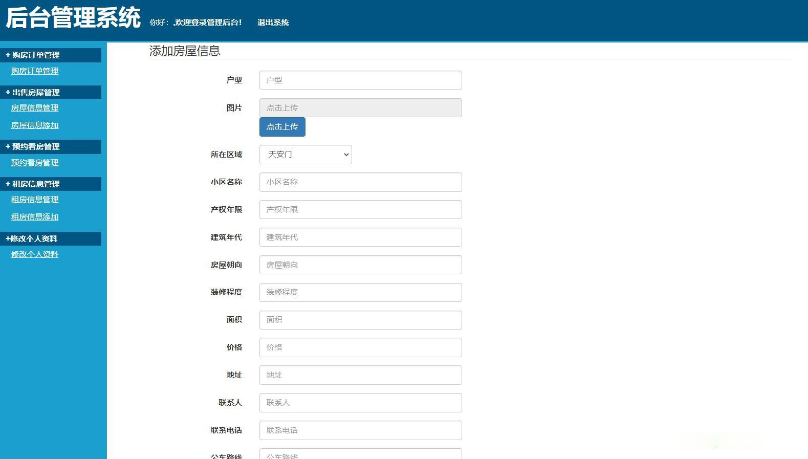
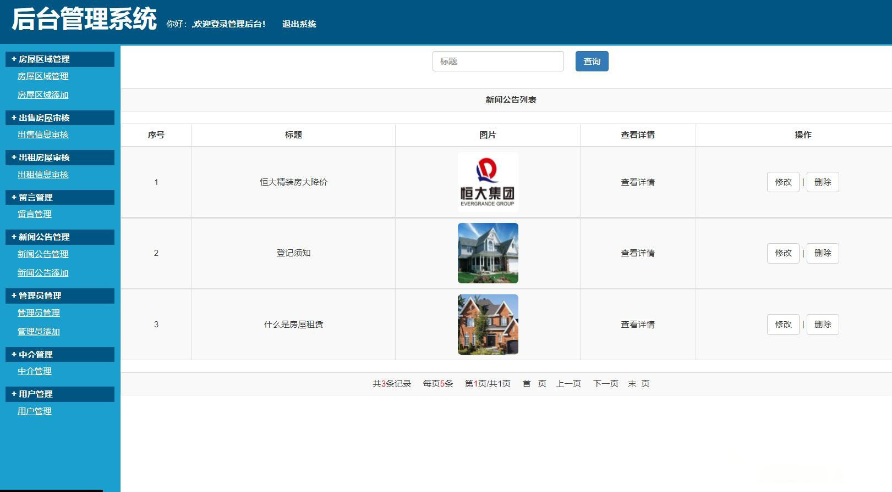

## 基于SSM框架的房屋出租租赁管理系统(程序+报告)

###  获取sql数据库文件: 从戎源码网 (https://armycodes.com/) QQ: 386869957 QQ群: 377586148
###  所有系统地址: (https://github.com/YuLin-Coder/AllProjectCatalog) 
###  所有项目以及源代码本人均调试运行无问题 可支持远程安装部署调试、定制修改、代码讲解

## 项目介绍
基于SSM框架的房屋出租租赁管理系统，系统分为用户，管理员，房屋中介三个角色：，主要功能如下
用户功能：
（1）用户可以登录和注册系统
（2）用户可以查看系统的相关新闻和公告信息
（3）用户查看房屋的出售信息，可以在线订购房屋，输入订购的相关信息，生产订购单
（4）用户查看房屋的出租信息，可以在线预约看房
（5）用户可以发布在线留言信息
（6）用户修改个人资料信息
房屋中介：
（1）中介发布和管理房屋的出租信息，信息需要管理员审核
（2）中介发布和管理房屋的出售信息，信息需要管理员审核
（3）中介查看用户房屋购买的订单
（4）中介查看用户的预约看房的信息
（5）中介修改个人资料信息	

管理员：
（1）管理员登录系统后台
（2）管理员管理房屋的区域位置信息
（3）管理员对中介发布的出售和出租房屋信息进行审核
（4）管理员管理用户的留言信息进行管理
（5）管理员对网站新闻公告的信息进行管理
（6）管理员可以对添加别的管理员登录后台
（7）管理员对房屋中介账户信息进行管理
（8）管理员对系统注册的用户进行管理

## 项目技术
- 编程语言：Java
- 数据库：MySQL
- 前端技术：JSP、JavaScript、bootstrap、JQuery
- 后端技术：Spring、SpringMVC、MyBatis

## 运行环境
- JDK版本：JDK1.8及以上
- 开发工具：IDEA、Ecplise、Myecplise都可以
- 数据库: MySQL5.7及以上
- Maven：maven3.0及以上

## 运行截图

